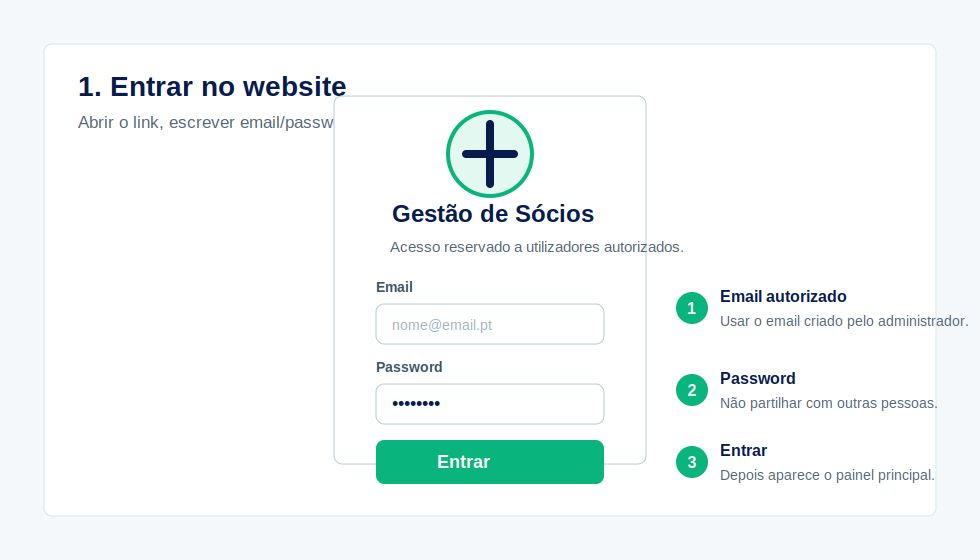
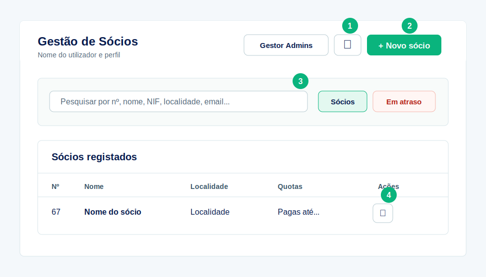
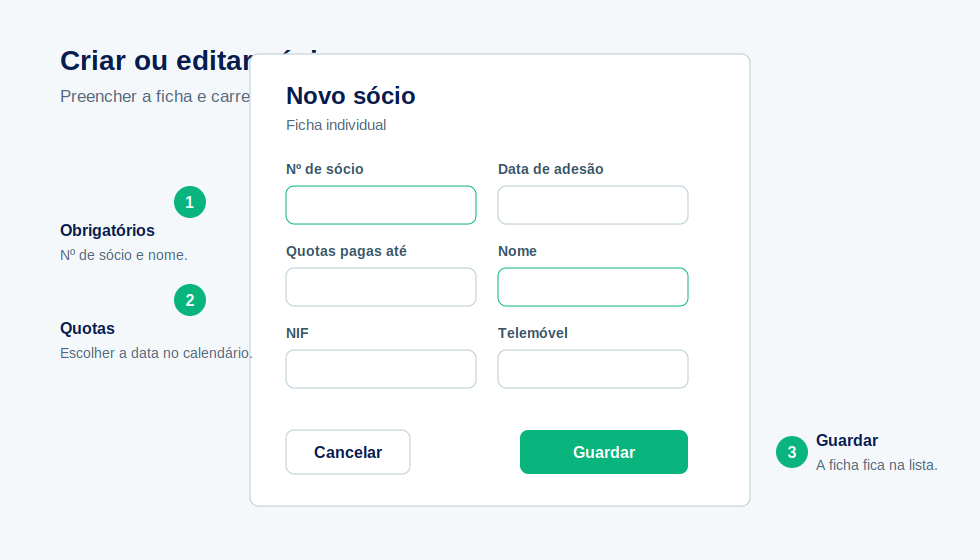
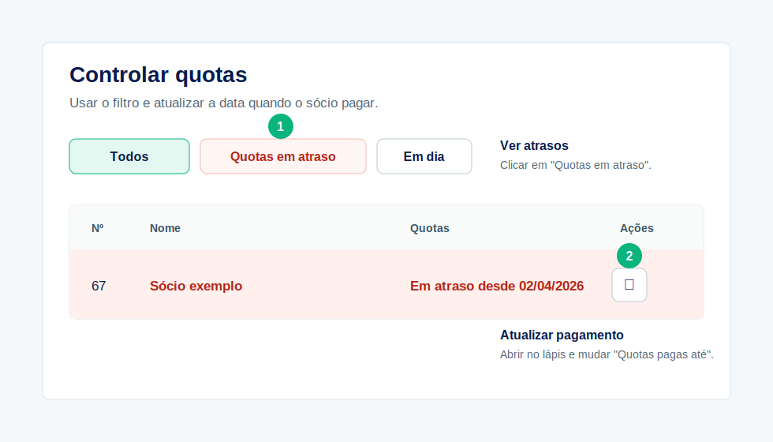
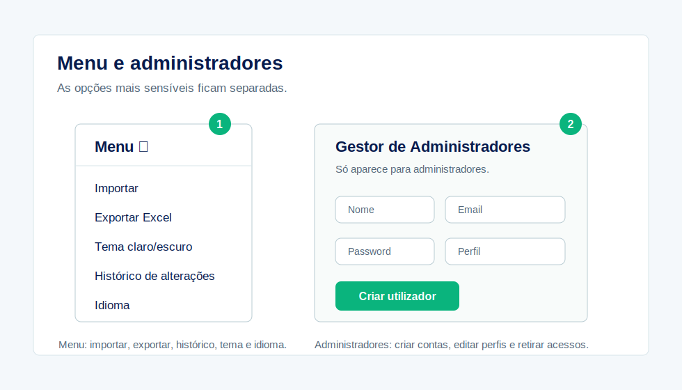

# Guia Rápido de Utilização

## Website de Gestão de Sócios

Este guia é para quem vai usar o website no dia a dia. Está feito para ser simples: ver a imagem, seguir os passos e usar.

Link do website:

`https://socios-mente-movimento.vercel.app`

## 1. Entrar

1. Abrir o website.
2. Escrever o email e a password.
3. Clicar em **Entrar**.

Notas rápidas:

- A conta tem de estar autorizada por um administrador.
- A opção **Lembrar neste dispositivo** guarda apenas o email, não guarda a password.
- Em computadores partilhados, terminar sempre a sessão no fim.

## 2. Painel Principal

O painel principal serve para ver e procurar sócios.

Usar principalmente:

- **Novo sócio** para criar uma ficha nova.
- **Pesquisar** para encontrar sócios por nome, nº, NIF, localidade ou email.
- **Quotas em atraso** para ver quem tem pagamentos atrasados.
- **Lápis** para editar a ficha de um sócio.
- **Menu dos três traços** para exportar, mudar tema, mudar idioma e ver histórico.

## 3. Criar ou Editar Sócio

1. Clicar em **Novo sócio** ou no **lápis** de um sócio existente.
2. Preencher ou alterar os dados.
3. Confirmar o **Nome** e, se existir, o **Nº de sócio**.
4. Preencher o **Nº de Ata de Aprovação**, se existir.
5. Escolher a **Última quota paga** e a **Data do pagamento**, se aplicável.
6. Clicar em **Guardar**.

Campos a ter atenção:

- **Nº de sócio** é opcional; quando for preenchido, não pode estar repetido.
- **Nº de Ata de Aprovação** é opcional; quando estiver vazio aparece como "Não atribuído".
- **NIF** deve ter 9 dígitos.
- **Código postal** deve estar no formato `0000-000`.
- **Última quota paga** indica o ano da quota, por exemplo `Quota de 2026`.
- **Data do pagamento** deve ser a data em que a quota foi registada como paga.

## 4. Controlar Quotas

Para ver atrasos:

1. Clicar em **Quotas em atraso**.
2. Ver os sócios destacados a vermelho.
3. Abrir o sócio no **lápis**.
4. Clicar em **Pagar quota** para avançar um ano ou atualizar manualmente a **Última quota paga**.
5. Clicar em **Guardar**.

Se a última quota paga for de um ano anterior ao ano em vigor, o sistema marca automaticamente o sócio como estando em atraso.

## 5. Menu, Histórico e Administradores

No **menu dos três traços** existem estas opções:

- **Exportar**: guardar uma folha de cálculo `.xlsx`.
- **Tema claro/escuro**: mudar o aspeto do site.
- **Histórico de alterações**: ver quem alterou sócios e quando.
- **Idioma**: escolher português ou inglês.

O botão **Gestor de Administradores** só aparece para administradores.

Nesse gestor é possível:

- Criar utilizadores.
- Escolher perfil: Administrador, Operador ou Consulta.
- Ativar ou desativar contas.
- Eliminar utilizadores.

## 6. Perfis de Acesso

| Perfil | O que pode fazer |
| --- | --- |
| Administrador | Pode fazer tudo, incluindo gerir utilizadores |
| Operador | Pode criar e editar sócios |
| Consulta | Apenas pode consultar informação |

Recomendação: manter pelo menos dois administradores ativos.

## 7. Boas Práticas

- Não partilhar passwords.
- Confirmar sempre o nome e, se existir, o nº de sócio antes de guardar.
- Verificar bem a última quota paga e a data do pagamento.
- Não apagar sócios sem necessidade.
- Desativar contas de pessoas que já não devem ter acesso.
- Exportar dados regularmente para backup.
- Usar o histórico quando houver dúvidas sobre alterações.

## 8. Problemas Comuns

| Problema | O que fazer |
| --- | --- |
| Não consigo entrar | Confirmar email, password e se a conta está ativa |
| Não vejo o Gestor de Administradores | A conta provavelmente não é administradora |
| Não consigo apagar sócios | Só administradores podem apagar |
| Sócio aparece em atraso | Usar "Pagar quota" ou atualizar a "Última quota paga" |
| Site parece antigo/desatualizado | Fazer `Ctrl + F5` |

## 9. Regra Mais Importante

Se não tiver a certeza, não apague dados. Edite a ficha, coloque uma observação interna ou peça ajuda a um administrador.
