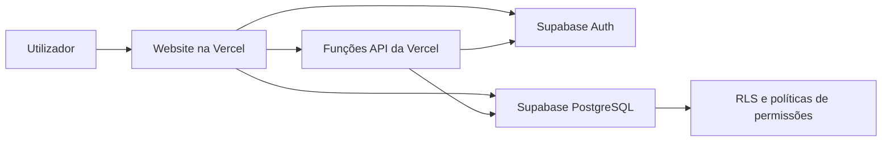

# Relatório Final do Projeto

## Gestão de Sócios MenteMovimento

### 1. Introdução

Este projeto consiste no desenvolvimento de uma aplicação web para a gestão de sócios da associação MenteMovimento. A aplicação foi criada para substituir métodos menos organizados, como folhas de cálculo, documentos soltos ou registos em papel, por uma solução online, centralizada e protegida.

O sistema permite guardar e consultar informação essencial dos sócios, controlar o estado das quotas, gerir utilizadores autorizados, consultar o histórico de alterações e exportar dados quando necessário. Por estar publicado online, pode ser usado em diferentes computadores, sem depender da máquina onde foi desenvolvido.

O projeto foi também pensado com preocupação de segurança, uma vez que trata dados pessoais como nome, morada, NIF, contacto telefónico, email e número de identificação civil.

### 2. Objetivos do Projeto

O objetivo principal foi criar uma plataforma simples, prática e segura para gerir os sócios da associação.

Os objetivos específicos foram:

- Criar uma base de dados online para guardar os dados dos sócios.
- Permitir criar, editar, pesquisar e eliminar sócios.
- Controlar qual foi a última quota anual paga por cada sócio.
- Destacar automaticamente sócios com quotas em atraso.
- Criar perfis de acesso com diferentes permissões.
- Permitir criar administradores diretamente pela aplicação.
- Registar alterações feitas aos dados dos sócios.
- Permitir exportar dados para consulta externa e backups.
- Publicar o sistema online para acesso em qualquer computador.
- Aplicar boas práticas de segurança.
- Criar uma interface simples, com tema claro/escuro e português/inglês.

### 3. Tecnologias Utilizadas

O projeto foi construído com tecnologias web simples e serviços cloud.

| Área | Tecnologia | Função |
| --- | --- | --- |
| Interface | HTML | Estrutura das páginas |
| Estilo visual | CSS | Layout, cores, tema claro/escuro e responsividade |
| Lógica da aplicação | JavaScript | Login, formulários, pesquisa, filtros, validações e comunicação com a base de dados |
| Base de dados | Supabase PostgreSQL | Armazenamento dos sócios, utilizadores e histórico |
| Autenticação | Supabase Auth | Login com email e password |
| Publicação | Vercel | Alojamento online do website |
| Funções seguras | Vercel Serverless Functions | Criação e eliminação segura de utilizadores |
| Versionamento | GitHub | Guardar código, partilhar projeto e publicar alterações |
| Ícones | Lucide | Ícones da interface |

### 4. Arquitetura Geral

A aplicação está organizada em três partes principais:

1. O website, que corre no browser do utilizador.
2. O Supabase, que guarda a base de dados e trata o login.
3. A Vercel, que publica o site e executa funções seguras.

O utilizador acede ao website através do link publicado. Depois de fazer login, o browser comunica com o Supabase usando uma chave pública segura para operações normais. A base de dados só aceita ações permitidas pelas políticas de Row Level Security.

Operações mais sensíveis, como criar ou eliminar contas de administradores, passam por funções da Vercel. Essas funções usam uma chave secreta guardada apenas no ambiente seguro da Vercel.

### 5. Estrutura do Projeto

Os principais ficheiros do projeto são:

| Ficheiro/Pasta | Descrição |
| --- | --- |
| `index.html` | Estrutura principal da aplicação |
| `styles.css` | Estilos, layout, tema claro/escuro e responsividade |
| `app.js` | Lógica da aplicação |
| `config.js` | Configuração pública do Supabase e opções da app |
| `vercel.json` | Headers de segurança e configuração da Vercel |
| `api/create-user.js` | Função segura para criar utilizadores |
| `api/delete-user.js` | Função segura para eliminar utilizadores |
| `supabase/schema.sql` | Estrutura inicial da base de dados |
| `supabase/harden-rls.sql` | Reforço das políticas de segurança |
| `assets/` | Logotipos da associação |
| `vendor/` | Bibliotecas locais usadas pela aplicação |

### 6. Funcionalidades Implementadas

#### 6.1 Login

A entrada na aplicação é feita com email e password através do Supabase Auth. Só utilizadores registados no Supabase e também autorizados na tabela interna `app_users` conseguem usar a aplicação.

Existe ainda uma opção "Lembrar neste dispositivo", que guarda apenas o email no browser para facilitar futuros logins. A password não é guardada.

#### 6.2 Gestão de Sócios

A aplicação permite criar fichas individuais de sócios com os seguintes campos:

- Nº de sócio, quando atribuído.
- Nº de Ata de Aprovação, quando atribuído.
- Data de adesão.
- Última quota paga.
- Data do pagamento da quota.
- Nome.
- Morada.
- Código postal.
- Localidade.
- Nº do BI ou CC, quando necessário.
- NIF.
- Categoria.
- Data de nascimento.
- Telemóvel.
- Email.
- Observações internas.

O nº de sócio e o nº de ata são opcionais. Quando o nº de sócio é preenchido, não pode ser repetido, o que ajuda a evitar duplicações e mantém a base de dados organizada. Quando algum destes números não é preenchido, a lista apresenta o estado "Não atribuído".

#### 6.3 Pesquisa e Filtros

O painel principal permite pesquisar sócios por:

- Nº de sócio.
- Nome.
- NIF.
- Localidade.
- Email.

Também existem filtros rápidos:

- Todos.
- Quotas em atraso.
- Em dia.

Quando a última quota paga corresponde a um ano anterior ao período em vigor, o sistema destaca o sócio como estando em atraso.

#### 6.4 Ordenação

A lista de sócios pode ser ordenada por diferentes critérios, como:

- Nome A-Z.
- Nº de sócio.
- Quota mais antiga.
- Quota mais recente.

Isto facilita a consulta quando existem muitos registos.

#### 6.5 Exportação

A aplicação permite:

- Exportar os dados em Excel `.xlsx`.
- Exportar os dados em CSV, útil para abrir em folhas de cálculo.

Esta funcionalidade permite criar cópias externas dos dados e trabalhar a informação em folhas de cálculo quando necessário.

#### 6.6 Histórico de Alterações

O sistema regista alterações feitas aos sócios através da tabela `member_audit_log`. Esta tabela guarda:

- Tipo de ação: criação, edição ou eliminação.
- Data da alteração.
- Utilizador responsável.
- Dados antigos.
- Dados novos.

Este histórico é importante para auditoria e para perceber quem alterou determinado registo.

#### 6.7 Gestão de Administradores

Existe uma área própria chamada "Gestor de Administradores". Nessa área, um administrador pode:

- Criar novos utilizadores.
- Definir nome, email, password e perfil.
- Editar utilizadores existentes.
- Ativar ou desativar acessos.
- Eliminar utilizadores autorizados.

A criação de utilizadores é feita através da função segura `api/create-user.js`, evitando a necessidade de criar utilizadores manualmente no painel do Supabase.

A eliminação de utilizadores passa por `api/delete-user.js`, que impede eliminar a própria conta e protege contra a eliminação do último administrador ativo.

#### 6.8 Temas e Idiomas

A aplicação tem:

- Tema claro.
- Tema escuro.
- Interface em português.
- Interface em inglês.

Esta funcionalidade torna o sistema mais confortável para diferentes utilizadores.

### 7. Perfis de Utilizador e Permissões

O sistema tem três perfis principais:

| Perfil | Permissões |
| --- | --- |
| Administrador | Pode consultar, criar, editar e eliminar sócios; exportar dados; gerir administradores; consultar histórico |
| Operador | Pode consultar, criar e editar sócios; exportar dados |
| Consulta | Pode apenas consultar dados |

Esta separação reduz o risco de alterações indevidas e permite dar a cada pessoa apenas o acesso necessário.

### 8. Base de Dados

A base de dados foi criada no Supabase usando PostgreSQL. As principais tabelas são:

#### 8.1 `app_users`

Guarda os utilizadores autorizados da aplicação.

Campos principais:

- `id`: identificador do utilizador no Supabase Auth.
- `email`: email do utilizador.
- `full_name`: nome apresentado na aplicação.
- `role`: perfil de acesso.
- `active`: indica se a conta está ativa.
- `created_at` e `updated_at`: datas de criação e atualização.

#### 8.2 `members`

Guarda os dados dos sócios.

Campos principais:

- `id`: identificador interno.
- `member_number`: nº de sócio, opcional e único quando preenchido.
- `approval_minute_number`: nº de Ata de Aprovação, opcional.
- `admission_date`: data de adesão.
- `quota_paid_until`: data técnica de fim do ano da última quota paga.
- `quota_paid_at`: data em que o pagamento da quota foi registado.
- `name`: nome do sócio.
- `address`: morada.
- `postal_code`: código postal.
- `locality`: localidade.
- `id_number`: nº do BI ou CC, opcional.
- `tax_number`: NIF.
- `profession`: categoria.
- `birth_date`: data de nascimento.
- `phone`: telemóvel.
- `email`: email.
- `notes`: observações internas.
- `created_by` e `updated_by`: utilizadores responsáveis.
- `created_at` e `updated_at`: datas de criação e atualização.

#### 8.3 `member_audit_log`

Guarda o histórico de alterações feitas aos sócios.

Campos principais:

- `id`: identificador da entrada.
- `member_id`: sócio alterado.
- `action`: tipo de ação.
- `changed_at`: data da alteração.
- `changed_by`: utilizador responsável.
- `old_data`: dados antes da alteração.
- `new_data`: dados depois da alteração.

### 9. Segurança

A segurança foi uma preocupação importante durante o desenvolvimento.

#### 9.1 Autenticação

O login é feito com Supabase Auth. Isto evita criar um sistema de passwords manual e permite usar um serviço já preparado para autenticação.

#### 9.2 Row Level Security

As tabelas principais têm Row Level Security ativo. Isto significa que mesmo que alguém tente comunicar diretamente com a base de dados, as políticas do Supabase continuam a controlar o que essa pessoa pode ler ou alterar.

Exemplos:

- Só utilizadores autorizados conseguem consultar sócios.
- Apenas administradores e operadores podem criar ou editar sócios.
- Apenas administradores podem eliminar sócios.
- Apenas administradores podem consultar o histórico.
- Apenas administradores podem gerir utilizadores autorizados.

#### 9.3 Proteção contra SQL Injection

A aplicação usa a API do Supabase e não constrói queries SQL diretamente a partir de texto introduzido pelo utilizador. Isto reduz fortemente o risco de SQL Injection.

Além disso, o Supabase e o PostgreSQL tratam as operações através de APIs estruturadas e políticas de acesso.

#### 9.4 Proteção contra Brute Force

O Supabase Auth aplica limites e controlos próprios sobre tentativas de login. A aplicação também tem suporte preparado para Cloudflare Turnstile, que pode ser ativado para mostrar CAPTCHA após tentativas falhadas.

Neste momento, o CAPTCHA está configurável mas desativado no `config.js`.

#### 9.5 Chaves Secretas

A chave pública do Supabase pode estar no frontend. A chave sensível `service_role` nunca deve estar no browser nem no GitHub.

Essa chave é guardada apenas nas variáveis de ambiente da Vercel e usada pelas funções seguras quando é necessário criar ou eliminar utilizadores.

#### 9.6 Headers de Segurança

O ficheiro `vercel.json` define vários headers de segurança:

- Content Security Policy.
- Bloqueio de iframe.
- `X-Content-Type-Options: nosniff`.
- Referrer Policy.
- Permissions Policy.
- Cache-Control restritivo.
- CORS restrito ao domínio de produção.

Estes headers ajudam a reduzir riscos de execução indevida de scripts, exposição por iframe, leitura indevida de conteúdo e cache de informação sensível.

#### 9.7 CSRF e Formulários

Os formulários usam `method="post"` e token CSRF interno. Isto evita que credenciais ou dados sensíveis caiam em query strings caso o JavaScript falhe.

#### 9.8 Validação de Dados

A aplicação valida vários campos antes de guardar:

- NIF com 9 dígitos.
- Código postal no formato `0000-000`.
- Nº de sócio opcional, mas sem repetição quando preenchido.
- Nº de Ata de Aprovação opcional.
- Telemóvel com formato aceitável.
- Data de nascimento sem datas futuras.
- Data de adesão coerente.
- Última quota paga coerente com a data de adesão.
- Data do pagamento da quota sem datas futuras.

Também existem restrições na base de dados para reforçar alguns formatos.

### 10. Testes e Verificações

Foram analisados relatórios do OWASP ZAP enviados durante o desenvolvimento. Os alertas principais foram revistos e classificados.

As principais conclusões foram:

- Não foram encontrados alertas altos.
- Os alertas de SQL Injection indicavam falsos positivos ou bloqueios antes de chegarem à aplicação.
- Foram corrigidos pontos relacionados com `method="post"`, CSRF, cache e headers.
- Alertas relacionados com cookies e CORS vinham sobretudo do Supabase/Cloudflare.
- O ponto mais importante manteve-se a correta configuração das políticas RLS.

Também foram feitos testes práticos de utilização após alterações de interface e publicação.

### 11. Como Usar a Aplicação

#### 11.1 Entrar

O utilizador acede ao website publicado na Vercel e introduz email e password. Se a conta estiver ativa e autorizada, entra no painel principal.

#### 11.2 Criar Sócio

Para criar um sócio:

1. Clicar em "Novo sócio".
2. Preencher os dados obrigatórios.
3. Preencher os restantes campos disponíveis.
4. Indicar a última quota anual paga e, se aplicável, a data do pagamento.
5. Guardar.

#### 11.3 Editar Sócio

Na tabela de sócios, clicar no botão de edição. Depois, alterar os dados necessários e guardar.

#### 11.4 Eliminar Sócio

Administradores podem abrir a ficha do sócio e usar a opção de eliminação. Esta ação deve ser feita com cuidado, porque remove o registo da lista principal.

#### 11.5 Ver Quotas em Atraso

Usar o filtro "Quotas em atraso". Sócios com a última quota anual em atraso aparecem destacados.

#### 11.6 Exportar Dados

O menu de ferramentas permite exportar uma folha de cálculo Excel `.xlsx`. O botão CSV continua disponível para quem quiser abrir uma lista simples no Excel ou noutra folha de cálculo.

#### 11.7 Gerir Administradores

O botão "Gestor de Administradores" permite criar, editar, ativar, desativar e eliminar utilizadores autorizados.

### 12. Manutenção do Projeto

Para manter o projeto saudável, recomenda-se:

- Manter pelo menos dois administradores ativos.
- Usar passwords fortes.
- Rever regularmente os utilizadores autorizados.
- Fazer backups periódicos da base de dados.
- Rever o histórico de alterações quando houver dúvidas.
- Não partilhar chaves secretas.
- Não colocar a chave `service_role` no GitHub.
- Confirmar que as variáveis da Vercel continuam configuradas.
- Manter o GitHub atualizado com as alterações.

### 13. Limitações Atuais

Apesar de funcional, o projeto ainda pode evoluir.

Limitações atuais:

- O envio automático de emails ainda não está implementado.
- O CAPTCHA está preparado, mas não ativo.
- Não existe ainda exportação PDF nativa.
- Não existem dashboards financeiros avançados.
- A app depende dos serviços Vercel e Supabase.
- A gestão de quotas guarda o último ano pago e a data em que esse pagamento foi registado, mas não guarda ainda recibos ou valores pagos.

### 14. Melhorias Futuras

Possíveis melhorias:

- Envio de email quando as quotas forem atualizadas.
- Avisos automáticos antes das quotas expirarem.
- Exportação de relatórios em PDF.
- Dashboard financeiro.
- Registo de pagamentos com valor, método e recibo.
- MFA/2FA obrigatório para administradores.
- Ativação de Cloudflare Turnstile.
- Backups automáticos programados.
- Domínio próprio da associação.
- Conversão para app desktop com Electron ou Tauri.
- Versão mobile/app no futuro.

### 15. Conclusão

O projeto resultou numa aplicação web prática e segura para gerir sócios da associação MenteMovimento. A solução permite centralizar dados, controlar quotas, gerir acessos e manter histórico de alterações.

A escolha de Supabase e Vercel permitiu criar uma solução online, acessível a partir de qualquer computador e sem depender da máquina de desenvolvimento. A utilização de perfis, RLS, funções seguras e headers de segurança torna o sistema adequado para o tipo de informação tratada.

O projeto fica preparado para manutenção futura e pode evoluir facilmente com novas funcionalidades, como envio de emails, relatórios PDF, backups automáticos e dashboards de quotas.

### 16. Anexo: Resumo para Apresentação Oral

Este projeto é uma aplicação web para a gestão de sócios da associação MenteMovimento. Foi desenvolvido com HTML, CSS e JavaScript, publicado na Vercel e ligado a uma base de dados Supabase.

A aplicação permite criar e gerir sócios, controlar quotas, pesquisar registos, exportar dados, consultar histórico de alterações e gerir administradores. Existem diferentes perfis de acesso para garantir que cada utilizador só consegue fazer as ações permitidas.

A segurança foi reforçada com autenticação, Row Level Security, validações, funções serverless para ações sensíveis, headers de segurança e boas práticas no tratamento de chaves secretas.

O resultado é uma solução online, organizada e preparada para ser usada pela associação em diferentes computadores.
